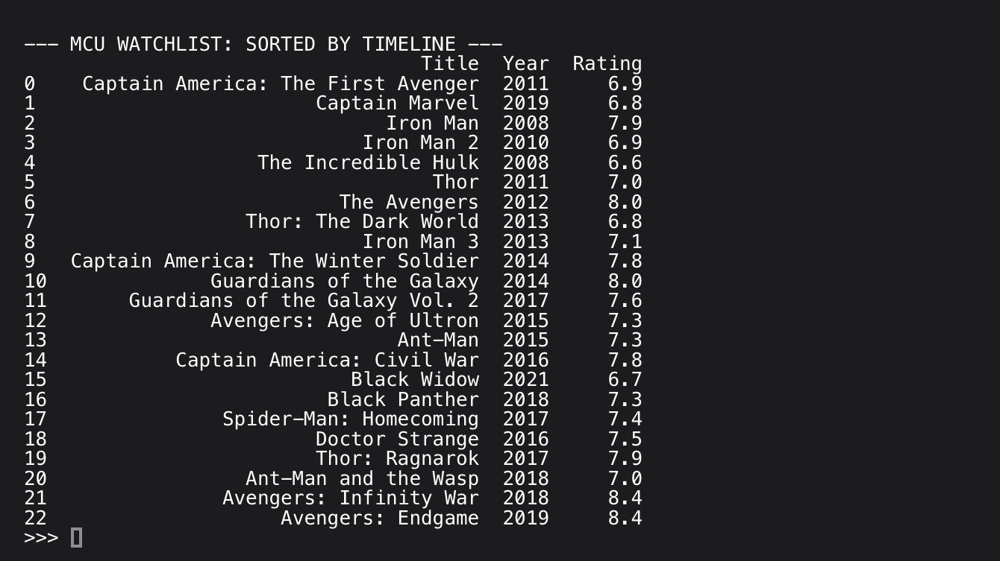

# Disney+ MCU Binge-Watch Optimizer

### Project Overview
This data-driven tool allows Disney+ users to optimize their Marvel Cinematic Universe (MCU) experience. Using the **Pandas** library, the script processes a multi-variable dataset to instantly re-sort 20+ films based on different fan preferences: Theatrical Release, Chronological Timeline, or Critic Ratings.

### Key Technical Features
* **Data Manipulation**: Utilizes `Pandas` DataFrames to manage and query complex movie metadata.
* **Toggleable Logic**: Features a dynamic sorting function that allows for one-click switching between "Release Year" and "In-Universe Timeline".
* **Quality Filtering**: Integrated IMDB/Rotten Tomatoes heuristics to allow users to prioritize high-rated content.
* **Scalable Architecture**: Designed to easily ingest new Phase 5 and Phase 6 data as it is released to Disney+.

### Technologies Used
- **Language**: Python 3
- **Libraries**: `pandas` (Data Analysis)
- **IDE**: Pyto (Mobile Development Environment)

### Why This Matters for Disney+
Modern streaming platforms rely on efficient metadata sorting to drive recommendation engines. This project demonstrates an understanding of how to structure "Binge-Watch" logic to increase user engagement on a digital platform.

---
*Developed as part of a Digital Media Portfolio for the Disney Professional Internship program.*
